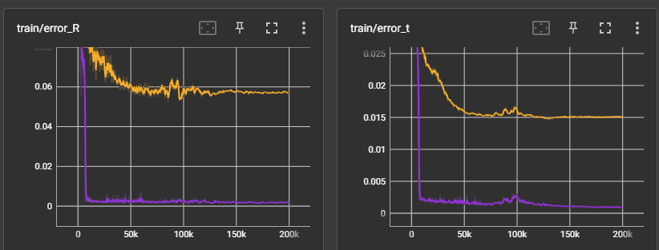

# DIM-SLAM
This is official repo for ICLR 2023 Paper "DENSE RGB SLAM WITH NEURAL IMPLICIT MAPS"
Heng Li, Xiaodong Gu, Weihao Yuan, Luwei Yang, Zilong Dong, Ping Tan

[paper](https://openreview.net/pdf?id=QUK1ExlbbA), [openreview](https://openreview.net/forum?id=QUK1ExlbbA), [Project](https://poptree.github.io/DIM-SLAM/)


The core part of sfm is released. The whole framework will be made public soom.

# Commom Q&A

1. Q: Where can I find the video demo for your framework?

    A: The video demo can be found on the OpenReview website. For more detailed information about our framework, please refer to our paper and the OpenReview page.

2. Q: Why are the poses of the first two frames in the ground truth pose?

    A: The ground truth poses are used to fix the scale in the world coordinate system. Without doing so, the size of the grid would be meaningless. If we did not use the ground truth poses, the estimated pose would only be up to a scale.

3. Q: Does the SfM part of your framework work with the LLFF dataset?

    A: Yes, our framework works with the LLFF dataset. As shown in Figure 1 of our paper, the orange and purple lines represent the BARF and our method's loss on the LLFF:Horns dataset. Our method converges much faster than BARF and achieves comparable results with the recent state-of-the-art methods as of March 2023.




If you find our code or paper useful, please cite:
```
@inproceedings{li2023dense,
  author    = {Li, Heng and Gu, Xiaodong and Yuan, Weihao and Yang, Luwei and Dong, Zilong and Tan, Ping},
  title     = {Dense RGB SLAM With Neural Implicit Maps},
  booktitle={Proceedings of the International Conference on Learning Representations},
  year      = {2023},
  url={https://openreview.net/forum?id=QUK1ExlbbA}
}
```

